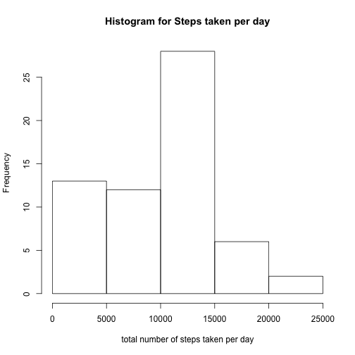
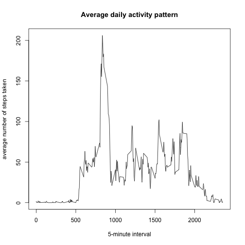
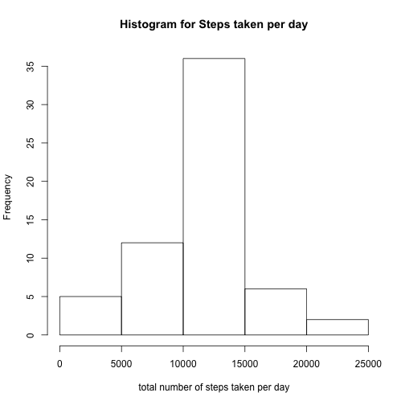
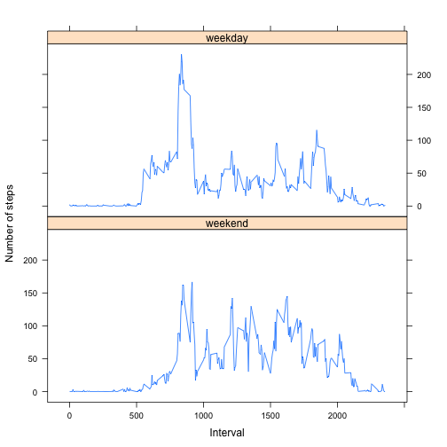

# I. Loading and preprocessing the data
## 1. Load the data
## 2. Process/transform the data if necessary

```r
setwd("/Users/teresayan/rprogram/course5/RepData_PeerAssessment1")
activity <- read.csv("activity.csv",sep=",",header=TRUE,na.strings=c("NA"),skipNul=TRUE)
```

# II. What is mean total number of steps taken per day?
## 1. Make a histogram of the total number of steps taken each day
## 2. Calculate and report the mean and median total number of steps taken per day


```r
groups <- group_by(activity, date)
steps <- summarize(groups, total=sum(steps,na.rm=TRUE))
hist(steps$total,
     main="Histogram for Steps taken per day",
     xlab="total number of steps taken per day")
```

 


```r
mean(steps$total)
```

```
## [1] 9354.23
```
## mean is 9354.23


```r
median(steps$total)
```

```
## [1] 10395
```
## median is 10395

# III. What is the average daily activity pattern?
## 1. Make a time series plot (i.e. type = "l") of the 5-minute interval (x-axis) and 
##    the average number of steps taken, averaged across all days (y-axis)
## 2. Which 5-minute interval, on average across all the days in the dataset, 
##    contains the maximum number of steps?


```r
par(mfrow=c(1,1))

groups_interval <- group_by(activity, interval)
average <- summarize(groups_interval, average_steps=mean(steps,na.rm=TRUE))

with(average, plot(interval, average_steps, type="l", xlab = "5-minute interval", ylab="average number of steps taken"))
title(main="Average daily activity pattern")
```

 

## interval 835 contains the maximum number of steps on average which is 206.1698


```r
max_averagesteps = max(average$average_steps)
max_averagesteps
```

```
## [1] 206.1698
```

```r
average$interval[average$average_steps==max_averagesteps]
```

```
## [1] 835
```

# IV. Imputing missing values


```r
sum(is.na(activity$steps))
```

```
## [1] 2304
```
## 1. number of rows with NA is 2304
## 2. strategy for filling in missing values in the dataset using the mean for that 5-minute interval

## index of rows in activity which has NA values
## dim(activity)
## [1] 17568     3


```r
na_index = which(is.na(activity$steps))
```

## average
## dim(average)
## [1] 288 2

## 3. a new dataset that is equal to the original dataset but with the missing data filled in.

```r
for (i in 1:nrow(activity)) {
    # check if it is NA
    if (is.na(activity$steps[i])) {
        # get the 5-minute interval from the index
        interval <- activity$interval[i]
        # find corresponding 5-minute mean from average dataframe
        #activity[i] <- average$average_steps[which(average$interval == interval)]
        activity$steps[i] <- average$average_steps[which(average$interval == interval)]
    } 
}
```

## 4. histogram of the total number of steps taken each day


```r
groups <- group_by(activity, date)
steps <- summarize(groups, total=sum(steps,na.rm=TRUE))
hist(steps$total,
     main="Histogram for Steps taken per day",
          xlab="total number of steps taken per day")
```

 

## What is mean total number of steps taken per day?

```r
mean(steps$total)
```

```
## [1] 10766.19
```
## mean is 10766.19 compared to previous 9354.23


```r
median(steps$total)
```

```
## [1] 10766.19
```
## median is 10766.19 compared to previous 10395

## yes, the mean and median have values differ from the estimates of the first part of the assignment, 
## the impact of inputing missing data on the estimates of the total number of steps: 
## it decreases the total number of steps


# V. Are there differences in activity patterns between weekdays and weekends?
## 1. Create a new factor variable in the dataset with two levels -- "weekday" and "weekend" indicating 
##    whether a given date is a weekday or weekend day.

## function to determine weekday or weekend

```r
weekdayOrWeekend <- function(s) {
    switch(s, "Sunday"="weekend",
              "Monday"="weekday",
              "Tuesday"="weekday",
              "Wednesday"="weekday",
              "Thursday"="weekday", 
              "Friday"="weekday", 
              "Saturday"="weekend")
}

activity$day <- sapply(activity$date, function(x) weekdayOrWeekend(weekdays(as.Date(x))))
```

## factor variable with two levels -- "weekday" and "weekend"

```r
activity.f <- factor(activity$day,levels=c("weekday","weekend"),labels=c("weekday","weekend"))
```

## 2. Make a panel plot containing a time series plot (i.e. type = "l") of the 5-minute interval (x-axis) and 
##    the average number of steps taken, averaged across all weekday days or weekend days (y-axis). 
## first find the average taken across all weekdays of 5-minute interval

```r
library(dplyr)
activity_weekday <- filter(activity, day=='weekday')
groups_interval_weekday <- group_by(activity_weekday, interval)
average_weekday <- summarize(groups_interval_weekday, weekday=mean(steps))
```

## second find the average taken across all weekends of 5-minute interval

```r
activity_weekend <- filter(activity, day=='weekend')
groups_interval_weekend <- group_by(activity_weekend, interval)
average_weekend <- summarize(groups_interval_weekend, weekend=mean(steps))

average_weekend_and_weekday = cbind(average_weekday, average_weekend)

average_weekend_and_weekday.f <- factor(activity$day,levels=c("weekday","weekend"),labels=c("weekday","weekend"))
```
## reorganize the datasets
## a panel plot containing a time series plot of the 5-minute interval for average number of steps taken
## across all weekday days or weekend days

```r
library(reshape2)
average_weekend_and_weekday.m <- melt(average_weekend_and_weekday, measure.vars=c("weekend", "weekday"))

xyplot(value~interval|variable, data=average_weekend_and_weekday.m, type="l",
    ylab="Number of steps", xlab="Interval", layout=c(1,2))
```

 

